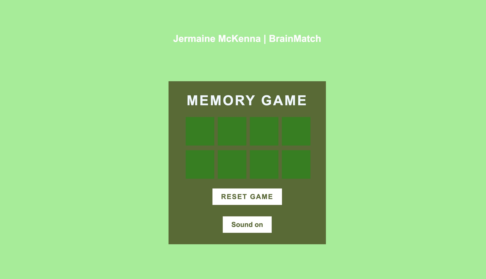

# 🧠 BrainMatch : Memory Challenege
---
BrainMatch is a browser-based card memory game designed to sharpen an indivduals memory and concentration skills. Users must flip and and match emoji pairs with a level challenging layout across five different modes. The memory game aims to improve cognitive function in a fun and rewarding way, by achieving this it is now suitable for users all ages who want to test and improve their memory while having fun.

