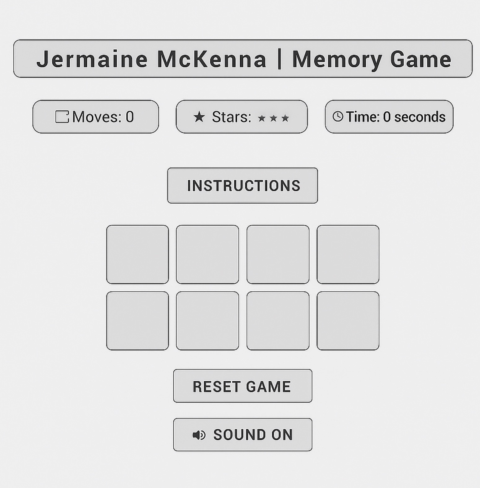
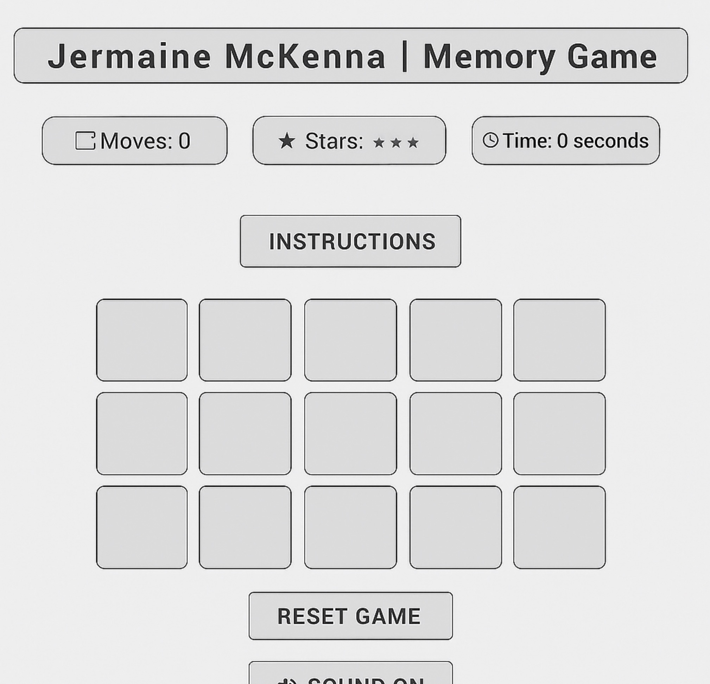
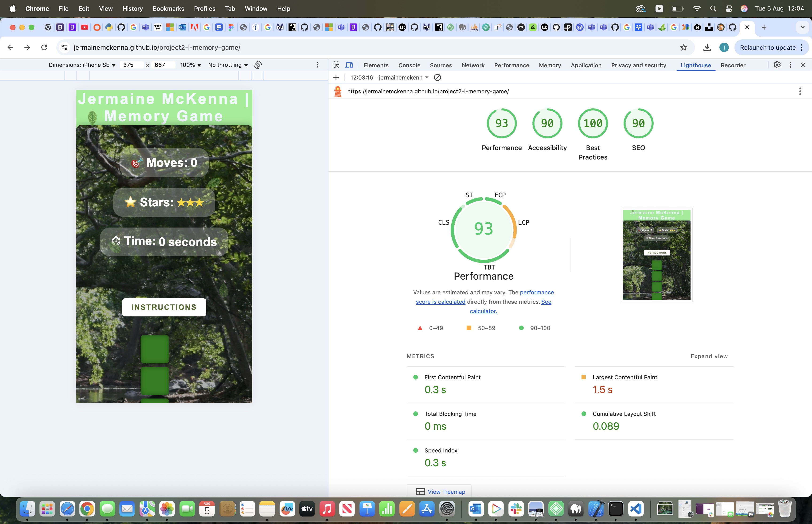
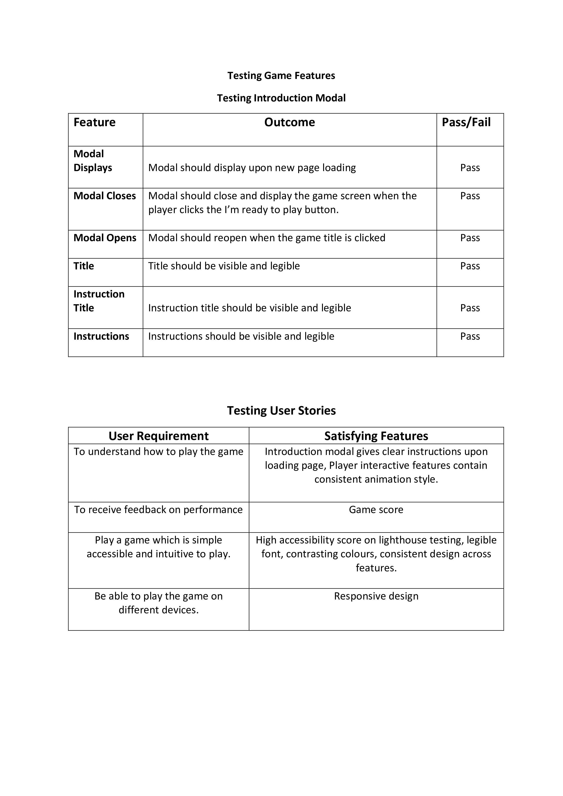
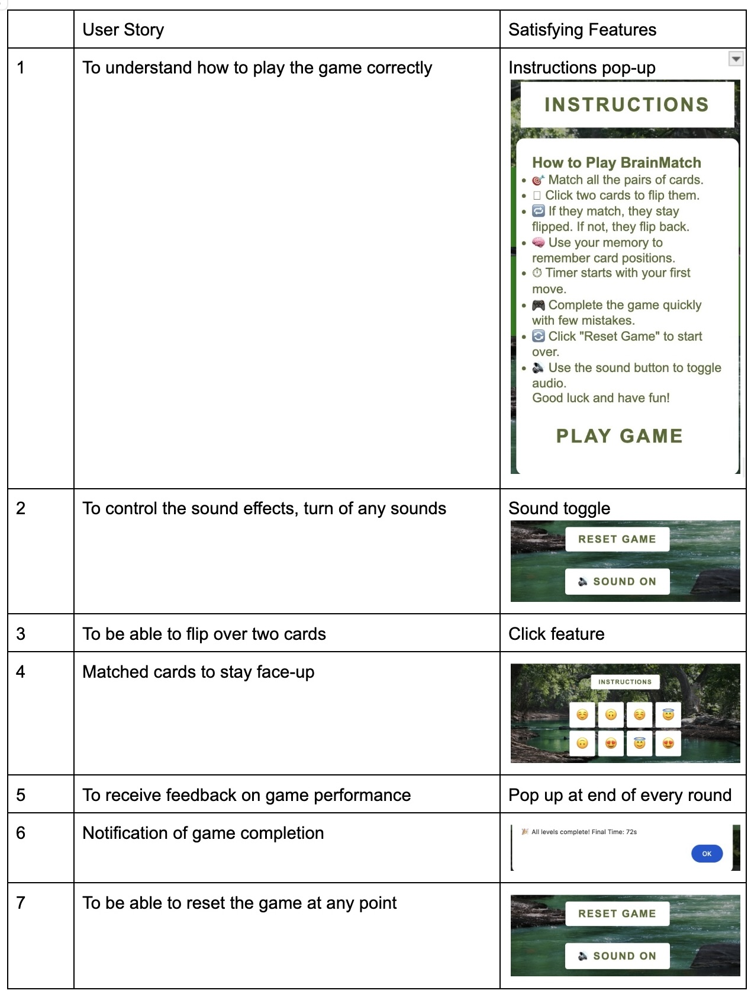
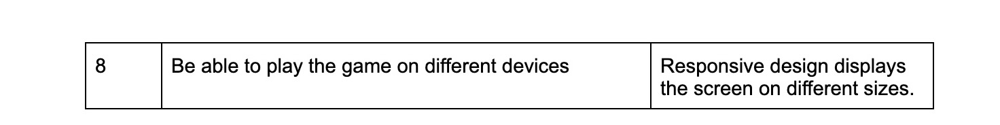
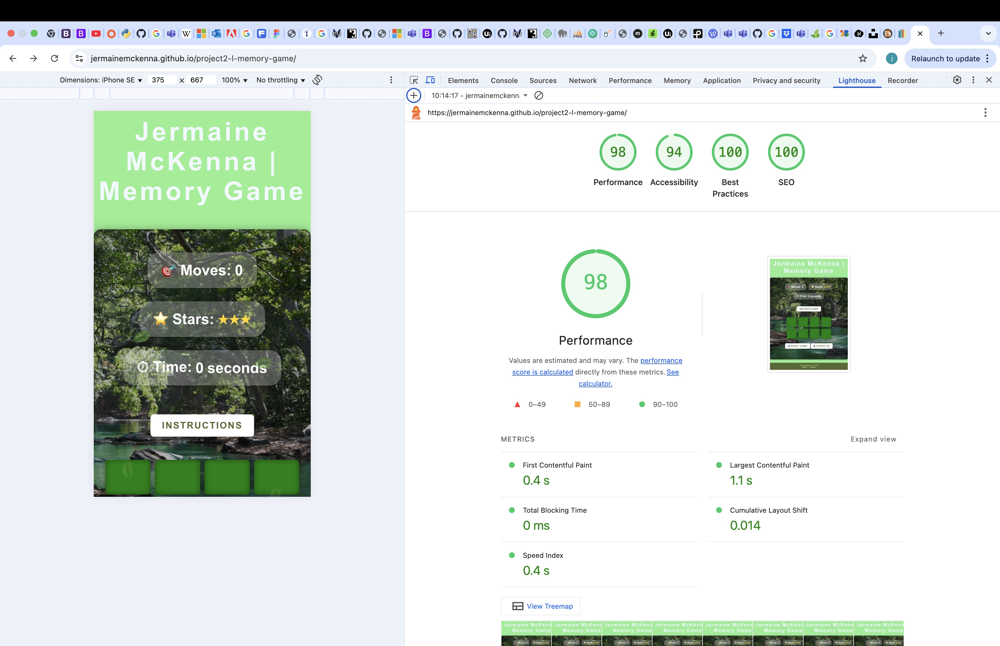
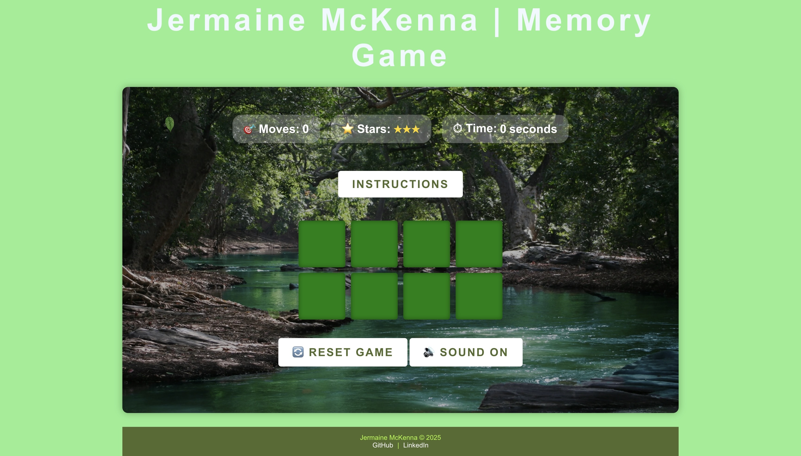

# 🧠 BrainMatch : Memory Challenege
---
BrainMatch is a browser-based card memory game designed to sharpen an indivduals memory and concentration skills. Users must flip and and match emoji pairs with a level challenging layout across five different modes. The memory game aims to improve cognitive function in a fun and rewarding way, by achieving this it is now suitable for users all ages who want to test and improve their memory while having fun.

---

## 👨🏾‍💻 User Experience 

- Create a card based game that gets the brain working, at the same time is fun to play.
- Clear instructions on how to play the game.
- Responsiveness design so the game can be played on all types of devices.
- The game increases in difficulty the more levels completed.
- Timer starts as soon as the first card is flipped over.

---

## 📖 User Stories

As a user i would like instructions on how to understand and play the game.

As a user i wouls like to be able to flip over the cards in the hope of matching a pair.

As a user i would like cards to flip back over if guessed incorrectly to keep the game fair.

As a user i would like matched cards to stay face-up.

As a user i would like a notification once i have completed a level on the game.

As a user i would like to know once i have completed all aspects of the game.

As a frequent user i would like to be able to toggle the sound on & off.

As a user i would like to be able to use the game on different devices.

---

## 🪛 Wireframe 

---

## 🎨 Colour Scheme and Font

The font Arial and Helvetica is what is used for the memory card game site. As one of the key traits of the website is simplicity but catchy at the same time, this font was chosen as it is clear and understandable for all types of users that wish to access the site and play the game. The font sans serif was also used as the fallback in case Arial and Helvetica are not accesible.

The colour scheme used in the backgroud of the game is light green. The colour used for different texts in the game varies from a colour of white to different types of green. This type of variety is a good mixture in creativity but also goes well with the layout of the game and the approach went with.

---

## ⭐️ Features

Introduction/Instructions Modal - 

The instructions modal/popup sits on top of the game and is clear and visible to users when they are on the game page, once clicked the popup opens with clear instructions on how to play the game. Inside the popup descriptions on other features the game has it detailed clearly.

Game Screen - 

The Game screen is essentialy the most important part of the website as this is where everything is happening, it contains all the features necessary to play and complete the game. As seen all features are fully visible on the game.

Game Cards - 

The Game cards is where the games magic happens, it's what user click and flip over in order to play and complete the game. The game begins with a certain amount of cards and then the further progress the user makes in completing levels the amount of cards increase to every level completed.

Game Buttons - 

The memory game has various buttons within it, that do different functions. Inside the instructions popup at the very end after the final instruction is a play game button, this is to be clicked once the user has read all the games details and is ready to start playing. There is a reset game button if the user wants to start from the very beggining also there is a sound off button for if the user wants to play the game with no sound effects from the page.

Game Title - 

The Game title is at the head of the game and clearly shows the creator of the game and the type of game the user is playing.

Game Completion MSG - 

Once the user has completed all the levels within the game, a popup message will appear at the top of the screen notifying the user all levels are now completed and they have finished the game.

## 🧰 Technologies Used

The following project was made and created from the following languages:

-HTML5
-CSS3
-JavaScript

[Google Fonts](https://fonts.google.com/) was used to browse, source and select the right font needed for the memory game.

[Git](https://git-scm.com/) and [GitHub](https://github.com/) was both used for version control and to make repositories.

## 🗣️ Credits

The [CSS documentation at mdn web docs](https://developer.mozilla.org/en-US/docs/Web/CSS) was mainly used a key reference point, when stying the memory game using CSS features.

When creating the README file I used the website [makeareadme.com](https://www.makeareadme.com/) aswell as using a [markdown cheatsheet](https://github.com/adam-p/markdown-here/wiki/Markdown-Cheatsheet) found on GitHub.

To create the features applied on the game I had sourced various videos on youtube that helped breakdown JavaScripts features and animations which I applied to my code [click here](https://www.youtube.com/watch?v=M0egyNvsN-Y).

[this blog on elated.com](https://www.elated.com/javascript-timers-with-settimeout-and-setinterval/) did help in understanding and applying the games timer.

When deciding on a game layout and design, I had already had a good idea of what i wanted but after looking online I went with a square/card layout which was help chosen from [helpful games](https://www.helpfulgames.com/subjects/brain-training/memory.html)

When trying to apply the cards correctly within the game i used [web design](https://webdesign.tutsplus.com/how-to-build-flexible-modal-dialogs-with-html-css-and-javascript--cms-33500t) in helping me apply the right modal.

For Java Animations and understanding and inputting them correctly within a file I used [this site](https://css-tricks.com/getting-deep-into-shadows/).

To build table for the features testing i used [google docs](https://docs.google.com/document/u/0/).

To build the wireframes for the webpage [figma](https://www.figma.com/files/team/1520135412037779099/recents-and-sharing?fuid=1520135407288540892) was used.

To source the back-ground image used within the main base of the game I used [unsplash backgrounds](https://unsplash.com/backgrounds).

---

## 🧪 Testing 

Bugs - 

Experienced a bug on the next level and game completion pop up at the top of the game, the bug was through the level completion pop up which stated details of my github at the very top, just above the level completion message, this bug was showing at the end of every level and also once the game had been completed.

Another big bug which was identified later on in the project was the type of javascript version i was using in my js.file. This was causing issues and erros within the project but once the issue was identified and corrected all issues were gone.

Trailing slashes in the meta tags has brought up alot of errors when i put my html code through the validator, but once i had removed closing tags all errors was gone from the validator.

Code Validation - 

CCS code validation.

I used the [W3C Markup validation service](https://jigsaw.w3.org/css-validator/#validate_by_upload) to check the validity of my CSS code.

This passed with no errors found.

---

HTML code validation.

I used the [W3C Markup validation service](https://validator.w3.org/) to check the validity of my HTML. 

From this check it highlighted a few info markers and one key error.

Since went back to the index.html file and identified the error code proplem fixed and checked code against validator, now showing no errors.

---

JavaScript code validation.

For testing the JS code I used [JS hint JavaScript validation service](https://jshint.com/)

No errors were found within the file.

---

Lighthouse testing.

The initial lighthouse test on the memory game page showed average scores for Accesibilty and SEO, but what was very worrying was the performance result.

From the report generated from the lighthouse test I was able to identify what the main source of the problem was which was causing the performance issues. The main issue was that my background image in my game design had to be compressed and converted to a different format in order for to game to perform to its best ability. This change was made.

---

Console Testing.

Manual testing 

## ✈️ Deployment

The Memory game was developed & created using Visual Studio Code, commited to Git and pushed to GitHub using the terminal & source control in VScode.

The final live version of the site is hosted on GitPages [here](https://jermainemckenna.github.io/project2-l-memory-game/) 

This is accomplished by:

1. Log in to your GitHub account.

2. Navigate to the repository you want to deploy.

3. Click on the [Settings](https://github.com/settings) tab found at the top of the repository.

4. In the left-hand menu, select [Pages](https://github.com/settings/pages).

5. Under Source, open the dropdown and select the main or master branch.

6. Click Save.

7. After the page refreshes, a link to the live site will be provided under the GitHub Pages section.

Detailed instructions on how to create a site on GitHub pages can be found [here](https://docs.github.com/en/pages/getting-started-with-github-pages/creating-a-github-pages-site)

Finished Site [click here](https://jermainemckenna.github.io/project2-l-memory-game/)

